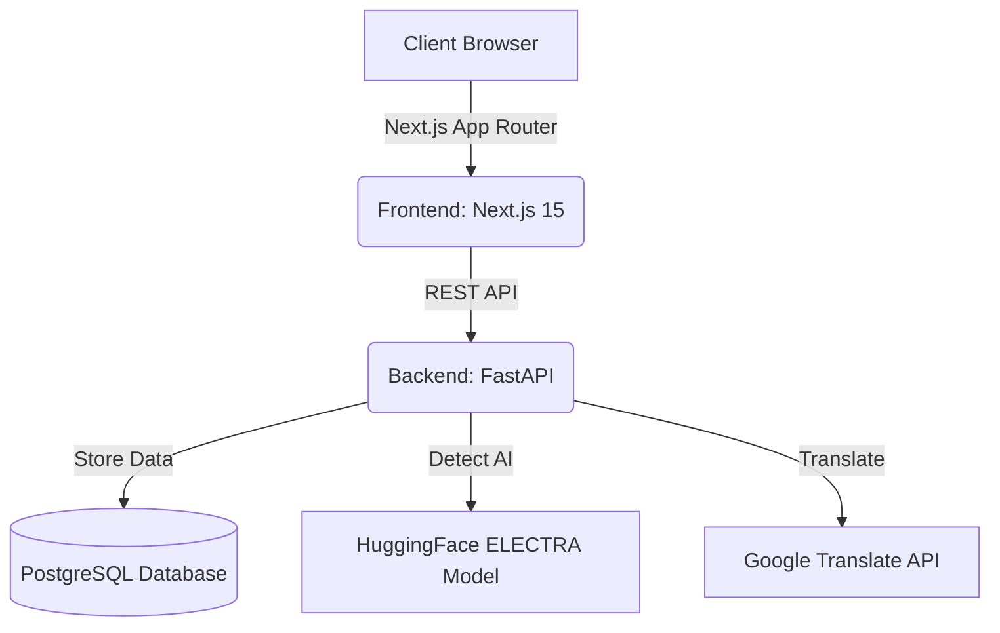

# TruthLens AI

TruthLens AI is a production-grade SaaS platform for advanced AI-generated content detection. It evolved from the open-source Chrome Extension to provide enterprise-grade reporting, API access, and comprehensive writing metrics.

## Architecture



## Features

- **Advanced AI Detection**: Deep sequence analysis using the ELECTRA neural network.
- **Sentence-Level Highlighting**: See exactly which sentences trigger the AI detectors with precise color-coding.
- **Multi-Language Support**: Built-in translation pipeline automatically processes non-English text.
- **Developer API**: Integrate TruthLens AI detection directly into your applications.
- **Historical Tracking**: Save, view, and export past analysis reports.
- **Browser Extension Integration**: Companion extension for checking content on the fly.

## Tech Stack

- **Frontend**: Next.js 15, React 19, TypeScript, Tailwind CSS, ShadCN UI, Framer Motion
- **Backend**: Python 3.11, FastAPI, SQLAlchemy, Pydantic
- **Database**: PostgreSQL
- **Deployment**: Docker, Docker Compose, GitHub Actions

## Quick Start (Local Development)

### Prerequisites
- Node.js 18+
- Python 3.11+
- Docker & Docker Compose (Optional but recommended)

### Running with Docker (Recommended)

1. Clone the repository
2. Copy the example environment file: `cp .env.example .env`
3. Start the services:
   ```bash
   docker-compose up --build
   ```
4. Access the frontend at `http://localhost:3000`
5. Access the API documentation at `http://localhost:8000/docs`

### Running Manually

**Terminal 1: Frontend**
```bash
cd frontend
npm install
npm run dev
```

**Terminal 2: Backend**
```bash
cd backend
python -m venv venv
source venv/bin/activate  # On Windows: venv\Scripts\activate
pip install -r requirements.txt
uvicorn app.main:app --reload
```

## Deployment

The project includes a GitHub Actions workflow `.github/workflows/deploy.yml` and Dockerfiles for production deployment. We recommend deploying the frontend to Vercel and the backend/database to a platform like Render or Railway.
